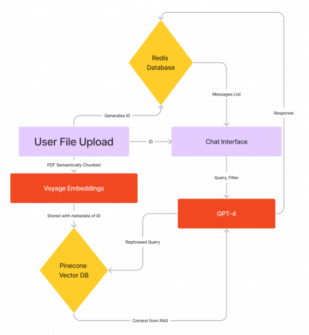

The project is available to use at [this link](https://infinitus-frontend.vercel.app/).

If you would like a better idea of the architecture, I've included a high-level diagram below.

The instructions are also on the site, but:
1. You may upload your own PDF using the upload section on the site. Once uploaded, it may take a moment to load before proceeding.
2. Alternatively, you may use a session ID if you have one. To access the Startup Playbook RAG chatbot, please use the ID "default."
3. Send questions to the chatbot! There's also a fun little voice filter in the top right if you would like to have the chatbot respond to you in certain ways.